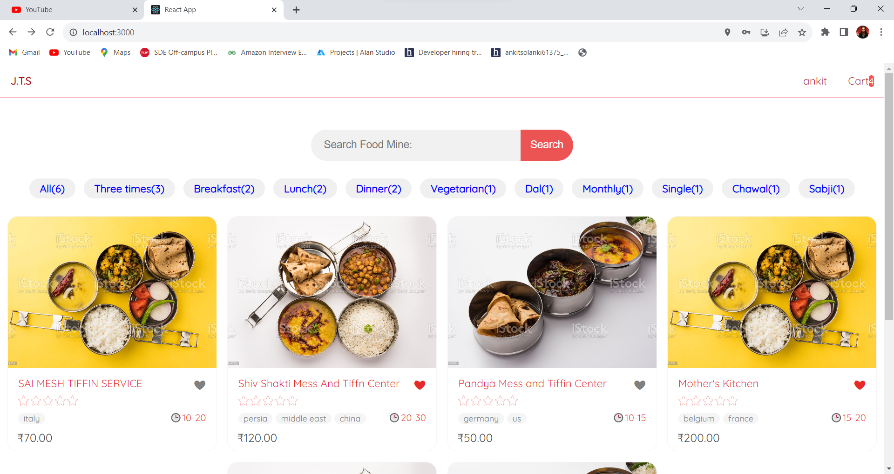
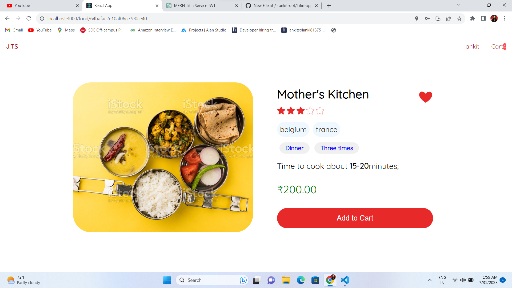
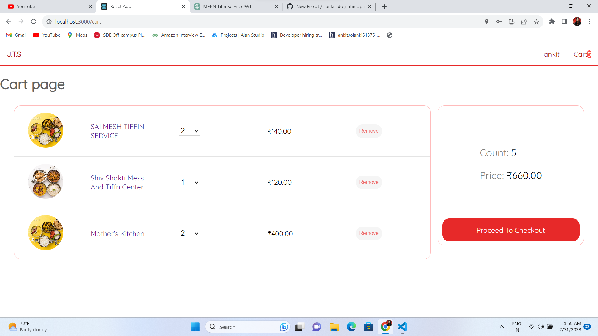
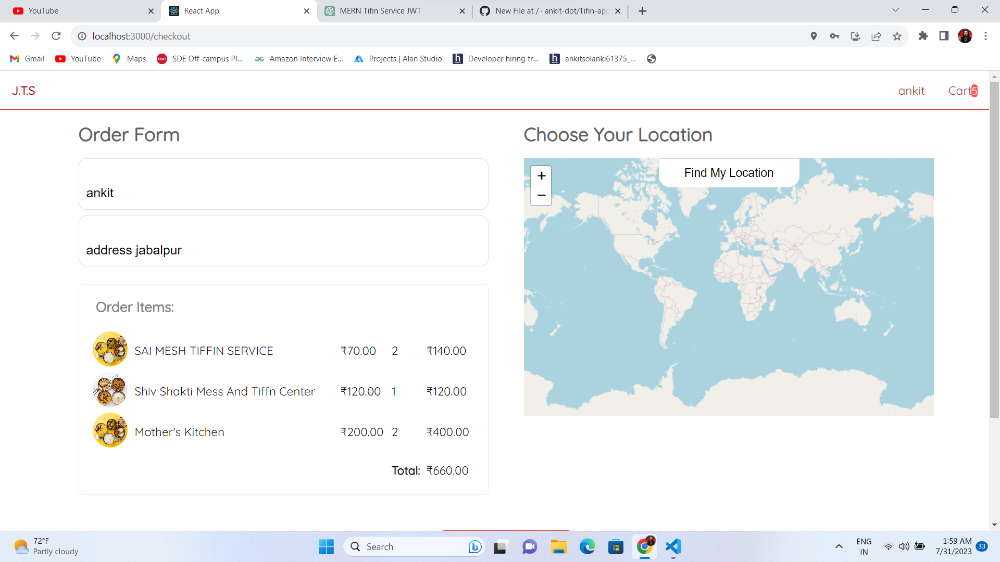

# Jabalpur Tifin Service (JTS)

Welcome to Jabalpur Tifin Service (JTS), a MERN (MongoDB, Express.js, React.js, Node.js) website that provides tifin services available in the neighborhood of Jabalpur.

## Table of Contents

- [Introduction](#introduction)
- [Features](#features)
- [Installation](#installation)
- [Usage](#usage)
- [Technologies](#technologies)
- [Contributing](#contributing)
- [License](#license)

## Introduction

Jabalpur Tifin Service (JTS) is a web application that enables users to explore and order tifin services available in the Jabalpur area. The website incorporates user authentication, allowing users to register, log in, add tifin items to the cart, and proceed to checkout.

## Features

- User authentication
- Home Page - Displaying available tifin services
- Cart Page - Adding and managing selected tifin items
- Checkout Page - Reviewing the order and finalizing the purchase

## Installation

To run Jabalpur Tifin Service (JTS) locally, follow these steps:

1. Clone the repository: `git clone https://github.com/your-username/your-repository.git`
2. Navigate to the project directory: `cd your-repository`
3. Install server dependencies: `npm install`
4. Navigate to the client directory: `cd client`
5. Install client dependencies: `npm install`
6. Go back to the main project directory: `cd ..`
7. Start the development server: `npm run dev`

Make sure you have MongoDB installed and running on your system.

## Usage

1. Visit the website homepage.

**Live website:** [Jabalpur Tifin Service JWT](https://www.example.com)

2. If you're a new user, click on the "Register" button to create an account, or log in with your credentials if you're an existing user.
3. Browse the available tifin services on the homepage.

4. Click on the items to view more details.
5. Add desired tifin items to your cart.

6. Navigate to the cart page to review and manage your selections.

7. Proceed to the checkout page, where you can confirm your order and make the final payment.

## Technologies

Jabalpur Tifin Service (JTS) is built using the following technologies:

- MongoDB - Database system
- Express.js - Backend web framework
- React.js - Frontend JavaScript library
- Node.js - Runtime environment for the server
